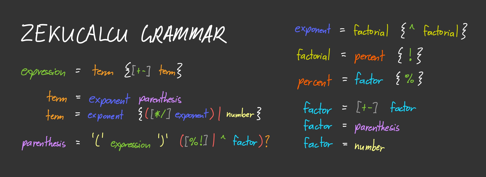

# Basic Calculator
## Content
[Description](#description)
  - [Main Objective](#main-objective)
  - [End Result](#end-result)

[Skills Required](#skills-required)

[Interesting Story](#interesting-story)

[What I learned](#what-i-learned)
  - [Classic Calculator](#classic-calculator)
  - [Advance Calculator](#advance-calculator)
  - [Recursive Descent Parser](#recursive-descent-parser)

## Description
This is the fifth and [last project](https://www.theodinproject.com/lessons/foundations-calculator) of the Foundations course of The Odin Project.

### Main Objective
Build a basic calculator which implements the _add_, _subtract_, _multiply_, and _divide_ functionalities.

### End Result
The UI of the finished calculator:

I built a calculator that adheres to the main objective and extended it to also support **negation** and **percent** (which divides the input by 100).

I also extended it to add an **advance mode** that supports typing expressions freely which inevitably lead me to also support **parenthesis**, **factorial**, and **exponential**.

I used a [Recursive Descent Parsing Algorithm](https://en.wikipedia.org/wiki/Recursive_descent_parser) to implement the evaluation of those freely typed expressions.

## Skills Required
- Store user's inputs
- Be able to operate the user's input of two numbers and its operation
  - Add
  - Subtract
  - Multiply
  - Divide
- Be able to handle floating point (ie. decimal) numbers

## Interesting Story
While I was reading through the instructions, I saw on point 6.1 to check [this student's solution](https://mrbuddh4.github.io/calculator/) since it contains the desired outcome behavior **but** I got cocky and did not want to look at it and also did not bother to read further instructions on point 6.

So the first thing that came to my mind is that we are supposed to let the user type in expressions. I did not know at the time how to accomplish this but I know there must be some kind of techniques compilers use to evaluate expressions so off I went to learn this "technique" which introduced me to recursive descent parser.

It took me a total of 4 hours, and 5 videos and 7 articles to finally understand how it works. And I was able to create a simple evaluator for the 4 basic arithmetic operators.

After accomplishing such an amazing feat (at least for me), I re-read the instructions again and _this time_, I still didn't look at the solution but I read all of point 6 and there I found out that the project calculator was more simple than I thought.

However, since I already bothered to learn such algorithm, I won't pass that knowledge up hence I added an **advance mode** for my calculator.

## What I learned
### Classic Calculator
This is the actual requested project from TOP.

Even though, it's pretty basic, I did not find it easy at all... Well, that's my fault since I wanted to support **chaining operations** where you can keep pressing `Enter` and it'll keep evaluating the previous result to the second operand you provided. (I noticed now that almost no one implemented this on the submitted projects.)

In order to achieve this, I need to keep track of:
- What's the current input? Left or right operand?
- If we are on the right operand, have we put in something yet? If so, stop chaining.
- Most importantly, we need to know if we have currently evaluated something so we know when to start a new calculation and to provide the correct display.

It was pretty tricky and I had to redo everything once I finished the first iteration of this classic calculator and got the feel of what I should have done.

### Advance Calculator
Once I have my `Evaluator` set up and working, it was pretty much a breeze since I only need to update the display according to the user's input and feed the value of the display in to the evaluator and voila! We got our results back.

Of course, the difficult part is to write down the `Evaluator` of string expressions.

### Recursive Descent Parser
So how does it work? How do compilers do it? How can I recreate JavaScript's `eval()` albeit only the basic-intermediate math part?

Basically, you define a set of grammars of what to do when you meet specific patterns of tokens or even another grammar itself. Doesn't make sense, ain't it? Let's dive deeper.

A [token](https://www.techtarget.com/whatis/definition/token#:~:text=A%20programming%20token%20is%20the,rules%20of%20the%20programming%20language.) is a basic component in a source code. Given a string of `-7 + 5/2.5 - 3*2`, we can divide them into these tokens: 

Notice how it basically divides the input into its most basic components, or tokens. This is called [Lexical Analysis](https://en.wikipedia.org/wiki/Lexical_analysis). 

Now that you know what a token is, let's define the following grammars below:

The first one means a pattern of a `T` then zero or more of `+` or `-` followed by another `T`.

What's a `T`? Well, it's defined in the second one: an `F` then zero or more `*` or `/` followed by another `F`.

Now, what's `F`? It's either a `-` or `+` followed by an `F`, or a number.

Using the example above `-7 + 5/2.5 - 3*2`, let's use the grammars we defined to create a **parse tree** from it and a [parse tree](https://en.wikipedia.org/wiki/Parse_tree) is just the **structural representation of our expression** which the structure is derived from the grammars. This is what helps us _to determine which operation goes first_: multiple/divide first before adding and subtracting, evaluate same precedence from left-to-right, etc.

1. Let's start on the first token `-` and on the first grammar `E`:
2. The first we meet is a `T` and that's another grammar rule so we go inside.
3. Inside `T`, we meet an `F` and again, another grammar rule so we go inside.
4. Inside `F`, we meet either a `-` or `+`: Is our token `-` matches any of these? Yes! So we consume this token and move to the next token `7`.
5. The `F` grammar rule is not finished yet, after either a `+` or `-`, we meet another `F`.
6. Inside this `F`, is our current token `7` the same as `+` or `-`? Nope! So we ignore the rest of that rule and move on to the next rule in `F` which is: Is `7` a number? Yes! So we consume this `7` and move on to the next token `+`.
7. Since there's nothing else after a number, we return.
8. We also return again since there's nothing else after a `-` or `+` followed by an `F` since we've just evaluated that.
9. Back to `T`, after the `F`, we meet a `*` or `/`. Does that match our current `+` token? Nope! 
10. And since this is the optional zero or more occurrences of `{[*/] F}` and we didn't match the first criteria, we return.
11. Back to `E`, after the `T`, we meet either `+` or `-` and does that match our current token `+`? Why, of course! So we consume it and move on to the next token `5`.
- The next rule after `+` or `-` is another `T` and we do the same story again until we consume all tokens.

The interesting part is _what are we to do if we meet same precedence_? Let's say we got to the second `-`, where do we put it in the tree? Well, obviously, we don't put it to the same `E` since it'll break the grammar rule for it. So where? Well, we put the entire `E` below another new `E`. This is called [left-associativity](https://en.wikipedia.org/wiki/Operator_associativity).

And finally, the final tree will look like this:

Though, that seems too convoluted... This is where [Abstract Syntax Tree (AST)](https://en.wikipedia.org/wiki/Abstract_syntax_tree) comes in. It basically means a **simpler representation of the parse tree**.

Let's remove all the grammar rules in the tree and we will have this elegant and easy-to-follow AST:

Now, we only need to traverse this tree to evaluate our expression. While we were _"consuming"_ tokens, that is the part where we create a [node](https://en.wikipedia.org/wiki/Node_(computer_science)) and append it to the tree so that we can traverse the tree afterward but I didn't make my solution this way, while we were consuming tokens, it's also already evaluating it and returning the result instead.

And that's how the recursive descent parsing algorithm I implemented work to evaluate these string expressions!

> Remember when I said 5 videos and 7 articles? Here are they (as far as I remember):
>
> Videos
> - The first four videos in module 4 of [Nand2Tetris Part 2 Course](https://www.coursera.org/learn/nand2tetris2) (Well, technically, I view this set of videos as one video :P)
>   - [Unit 4.1: Syntax Analysis](https://www.coursera.org/learn/nand2tetris2/lecture/5pC2Z/unit-4-1-syntax-analysis)
>   - [Unit 4.2: Lexical Analysis](https://www.coursera.org/learn/nand2tetris2/lecture/QM0lZ/unit-4-2-lexical-analysis)
>   - [Unit 4.3: Grammars](https://www.coursera.org/learn/nand2tetris2/lecture/rtIKX/unit-4-3-grammars)
>   - [Unit 4.4: Parse Trees](https://www.coursera.org/learn/nand2tetris2/lecture/G8Qql/unit-4-4-parse-trees)
> - [Top-Down Parsing | Recursive Decent Parsing](https://www.youtube.com/watch?v=nv9J5Jb7IxM) by Developer Zone
> - [Recursive Descent Parsing](https://www.youtube.com/watch?v=SToUyjAsaFk&t=1435s) by hhp3
> - [Recursive Descent Parser example](https://www.youtube.com/watch?v=eVwl0hkI21Y&t=265s) by Nigan Nayak
> - [Recursive Descent Parsing](https://www.youtube.com/watch?v=T4J3BPy__CU&t=590s) by David Broman
>
> Articles
> - [Scanning](https://craftinginterpreters.com/scanning.html) by Crafting Interpreters
> - [Representing Code](https://craftinginterpreters.com/representing-code.html) by Crafting Interpreters
> - [Parsing Expressions](https://craftinginterpreters.com/parsing-expressions.html) by Crafting Interpreters
> - [Parsing expression grammar](https://en.wikipedia.org/wiki/Parsing_expression_grammar) on Wikipedia
> - [Context-free grammar](https://en.wikipedia.org/wiki/Context-free_grammar) on Wikipedia
> - [Grammars and Parsing](http://ccl.pku.edu.cn/doubtfire/nlp/parsing/introduction/grammars%20and%20parsing.htm) by Allen
> - [Expression parser grammar and left-associativity](https://stackoverflow.com/questions/20318706/expression-parser-grammar-and-left-associativity) on StackOverflow
>
> What helped me a ton are the [Context-free grammar](https://en.wikipedia.org/wiki/Context-free_grammar) article, the **three articles on Crafting Interpreters**, [Recursive Descent Parsing](https://www.youtube.com/watch?v=SToUyjAsaFk&t=1435s) video by hhp3 and finally, **the four videos from Nand2Tetris** that actually made me understand it all. The icing on the cake!

Obviously, we only defined three grammar rules which evaluate the four simple math operations. 

I didn't bother looking back at the articles/videos nor searching on how to implement parenthesis, factorial, exponent, and percent. I came up with the solutions on my own and here's the final grammar set for my recursive descent parser algorithm!

